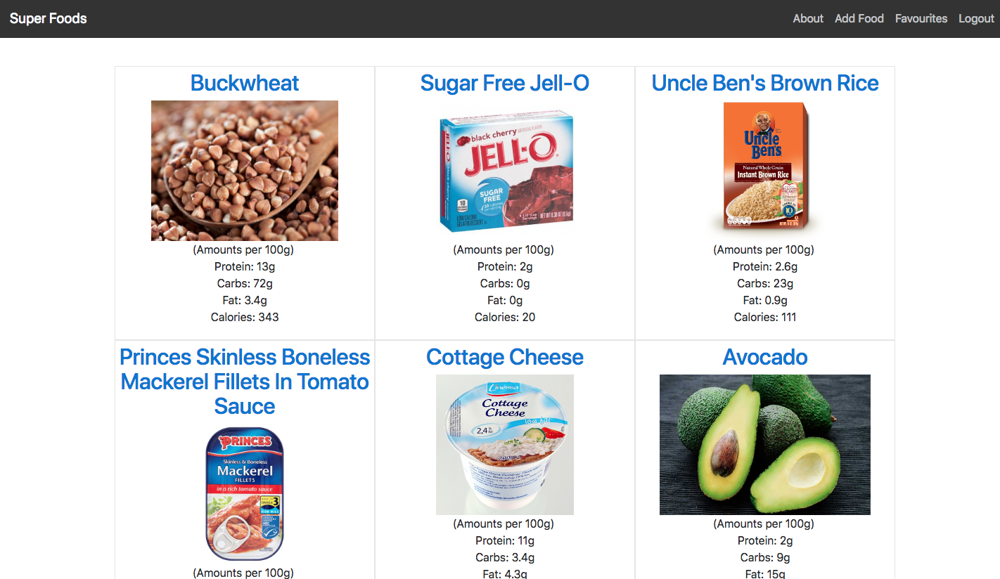

# WDI-Project-2

<h2>What is Super Foods?</h2>

This was my first Full-stack application which involved building a fully RESTful app containing all CRUD functionalities. Seen as fitness is a big part of my life, I decided to make an app that allows users to find foods that are inline with their fitness goals as well as logging their own recommended foods.

<h2>How to Use</h2>

When you load up the app, the first thing you will see is the landing page. Click the 'register' link, to register your <i>free</i> account.

On the index page, you will see all of the logged foods by users, with an image and the macronutrients for each food. If you click on a food, it will take you to its show page, whereby you can edit / delete the food (if you are the creator) or leave some comments. These comments can be deleted once submitted. If you want to favourite a food, you can click the favourite button which will display it on your favourites page.

<h2>Technologies Used</h2>
<ul>
  <li>HTML5</li>
  <li>CSS3 / SCSS</li>
  <li>JavaScript (ES6)</li>
  <li>EJS</li>
  <li>Bootstrap4</li>
  <li>Git</li>
  <li>Github</li>
  <li>Express.js</li>
  <li>MongoDB</li>
  <li>Mongoose</li>
  <li>Node.js</li>
</ul>

<h2>Wins</h2>
I think I was able to achieve a clean and modern design with my website and I think the layout is very neat. This app was particularly hard for me because I had never been exposed to backend programming 2 weeks prior, so in that regard I am happy with what I was able to achieve.

<h2>Challenges</h2>
The main challenges with the app was understanding how the Routes, controllers and views worked in conjunction with one another. Additionally, I found working with EJS to be very fiddly as it was really easy to misplace an EJS tag which would lead to a fatal error.

<h2>Future improvements</h2>
To further improve this app, I would add an unfavourite feature that deletes a food from the users favourite page. Additionally, I would also implement the ability to edit a comment once it has been submitted instead of having to outright delete it if you want to alter it.

<a href="https://cryptic-mountain-59882.herokuapp.com/">Click Here to launch the app In Heroku</a>
